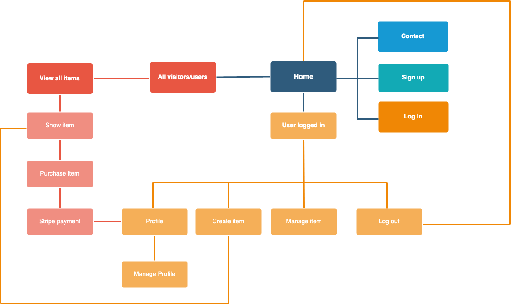

# T2A2 - Two-Way Marketplace Application
### Deanna Nicdao

#### R7.	Identification of the problem you are trying to solve by building this particular marketplace app.
It's been known that the road to success in art is a narrow one, largely due to the subjective nature of the market. This creates a tough environment for artists to successfully sell their artworks let alone acquire the funds for real estate to host art exhibitions and maintain a rental studio space. One approach to minimise costs is for artists is to exhibit their work online and create home studio spaces.

The internet has led to the increased exposure of art to a broader, even global, audience on several platforms, such as Etsy and Shopify. Etsy is a creative marketplace where craft supplies, homemade goods and vintage items can be sold. In contrast, Shopify is an eCommerce platform where general goods can be sold and their marketing, sales and operations can be managed. With access to such platforms, more and more artists have embraced digital technology for its benefits of increasing their marketability and creating a convenient platform for their client interactions. 

Despite the freedoms gained from a digital platform, artists are left to navigate and judge which of the platforms would best cater their goals. For example, they must consider whether their products will remain within the strict guidelines of what is allowed to be sold on the Etsy marketplace. It's likely that one might outgrow the Etsy constraints, yet a transition to another platform will cost revenue and a potential loss of customers. Moreover, upfront costs such as subscription-based selling fees, payment processing fees, listing and transaction fees per product need to be considered for platforms like Shopify. 

#### R8.	Why is it a problem that needs solving?
The general way for minimising costs as a digital artist is through the use of larger social media platforms such as Facebook, Twitter and Instagram. However, there is a lack of efficiency with the user experience for digital artists on social media sites due to the broad audience and applicability of the sites. Requests for commissions over direct messaging apps on these platforms can often get lost or lack organisation as the messenger applications are not built for logging requests for items. 

#### R9.	A link (URL) to your deployed app (i.e. website)
The art trade website, **Let's Gogh** can be accessed via this link: https://letsgogh.herokuapp.com/

#### R10.	A link to your GitHub repository (repo)
The repository for **Let's Gogh** can be accessed via this link: https://github.com/deannanicdao/letsGogh

#### R11.	Description of your marketplace app (website), including:
#### Purpose and Target Audience
*Let's Gogh* was created in response to the growing digital market costs of platforms such as "etsy.com" and "shopify.com". *Let's Gogh* aims to provide a simple marketplace platform for digital artists to sell their pieces without the constraints of larger online platforms and for customers to request art without navigating through the noise of other product categories or general social media. Commissioned rates can be provided by the artist and clients will be able to purchase their existing listings from the site. 

The target audience is kept specific to digital artists to ensure an efficient user experience. By providing a platform specific for digital art trade, a cleaner user experience is provided for both ends of the marketplace clientele by redirecting the trade from an instant messenger to a trading platform with fewer constraints and a more favorably-tailored user journey.

#### Functionality and features
*Let's Gogh* greets the user with a buy or sell art option with a navigation bar for signing in. There are two roles currently on the app: admin and users. All users can edit their profile by viewing their `own listings` and clicking on the `edit my profile` link. The user can view all listings. The user can view their own listings and create, delete or edit their own existing listings. The admin user can view all existing listings and can delete listings (if they find an inappropriate listing for example). 

Users can also purchase existing listings and will be redirected to stripe. Once the transaction is complete, they will be redirected back to the item's show page with a message notifying the user whether the transaction was successful or cancelled. 

#### Sitemap :microscope:

#### Screenshots :camera:

#### Tech stack (e.g. html, css, deployment platform, etc) :cd:

	

		<b> Ruby on Rails </b>
	

	
Rails is a web application development framework that is written in the Ruby programming language. The aim of Rails is to ease development of web applications by providing boiler-plates in a model, view and controller format. This minimizes the amount of initial code required from the developer but the developer must follow its *convention over configuration* philosophy.
	
[Rails v- 6.0.3.4](https://edgeguides.rubyonrails.org/getting_started.html)

[Ruby v- 2.7.1p83](https://ruby-doc.org/stdlib-2.7.2/)

	

		<b> PostgreSQL </b>
	

	
PostgresQL is an object-relational database management system that is built on the SQL language, developed at the University of California at Berkeley Computer Science Department. It is open-source and free and is capable of handling workloads on the data warehouse level. 
A large part of the SQL standard is supported and offers many modern features:
+ complex queries
+ foreign keys
+ triggers
+ updatable views
+ transactional integrity
+ multiversion concurrency control

The user can also add new:
+ data types
+ functions
+ operators
+ aggregate functions
+ index methods
+ procedural languages
	
[PostgreSQL](https://www.postgresql.org/docs/10/index.html)

	

		<b> HTML 5 </b>
	

	
HTML5 is a markup language which structures and presents content on the World Wide Web. HIt introduces elements and attributes such as semantic replacements for common uses of generic block `
` and inline elements, ``. It also specifies scripting application programming interfaces (APIs) used in junction with Javascript, by extending existing Document Object Model (DOM) interfaces.
	
[HTML5](https://developer.mozilla.org/en-US/docs/Web/Guide/HTML/HTML5)

	

		<b> SCSS - Bootstrap </b>
	

	
Bootstrap, once used for Twitter as *Twitter Blueprint*, is a popular front-end framework. It has since become an open-source project and serves as a style guide for internal tools development. It has evolved to integrate mobile-responsiveness, Sass and CSS's flexbox.

[Bootstrap](https://getbootstrap.com/docs/4.5/getting-started/introduction/)

	

		<b> Javascript </b>
	

	
JavaScript is a compiled programming language that is prototype-based, multi-paradigm, single-threaded, dynamic language and supports object-oriented, imperative, and declarative (*e.g.*, functional programming) languages. It runs on the client side of the web and is widely used for controller web page behaviour by functioning as a procedural and object oriented language. Objects are programmatically created with attached methods and properties. Once constructed, the object can be used a template or prototype for creating similar objects.

[Javascript](https://developer.mozilla.org/en-US/docs/Web/JavaScript)

### Ruby Gems :gem:

	

		<b> Devise </b>
	

	
Devise is used for user authentication. It provides sign-ups, confirmations, password changes and editing user details. 

[Devise Gem](https://rubygems.org/gems/devise)

	

		<b> Rolify </b>
	

	
Rolify was used in conjunction with Devise and CanCanCan to add roles to users. Two roles were implemented: admins and users. As explained above in features, admins can do everything the user can do (*i.e.*, CRUD listings) with the additional privilege of deleting other users' listings. 

[Rolify Gem](https://rubygems.org/gems/rolify)

	

		<b> CanCanCan </b>
	

	
CanCanCan is used to add authorisation to the user roles shown in the `ability.rb` file. This way users can view their own listings or all listings and the admin can view all listings with the additional option to delete any user's listing. 

[CanCanCan Gem](https://rubygems.org/gems/cancancan)

	

		<b> Stripe </b>
	

	
Stripe gem is used to redirect the user to an online payment platform (Stripe). It allows the user to purchase an existing listing at the advertised price. After the transaction, the user is redirected to the item's show page. 

[Stripe Gem](https://rubygems.org/gems/stripe)

	

		<b> Cloudinary </b>
	

	
The Cloudinary gem allows for cloud storage of assets onto the third-party Cloudinary service. This is used for image uploads through the applicaiton.

[Cloudinary Gem](https://rubygems.org/gems/cloudinary)

	

		<b> Simple Form </b>
	

	
Simple form was used with Devise to provide a layout for the sign up form. 

[Simple Form Gem](https://rubygems.org/gems/simple_form/versions/5.0.2)

    

        <b> Dotenv </b>
    

    
Dotenv is used for securely storing sensitive information that is accessed by the application through the use of environment variables. The `.env` file is included in the `.gitignore` file. 

[Devise Gem](https://www.rubydoc.info/gems/dotenv/2.1.1)

### Third Party Services

	

		<b> Cloudinary </b>
	

	
Cloudinary is an image and video cloud hosting service that can dynamically optimise images without the hassle of managing media assets. It is used to store any images uploaded by the users. 

[Cloudinary](https://cloudinary.com/)

	

		<b> Heroku </b>
	

	
Heroku is a Platform as a Service (PaaS) where developers can deploy and run their applications. Developers can also manage, and scale their apps entirely in the cloud as it supports Ruby and other programming languages. The free service model of Heroku has allowed this application to be deployed through an attached git repository. 

[Heorku](https://www.heroku.com/home)

	

		<b> Github</b>
	

	
Last but not least it Github, a developers best friend. GitHub is a website and cloud-based service that helps developers store and manage their code, as well as track and control changes to their code.

[Github](https://github.com/)

#### R12.	User stories for your app :memo:
+ Users can view all listings
    + User has signed in to view all listings
    + Users can purchase listings
+ Users can create, edit, show, delete their own listings
    + Users must be signed in
    + Listings must have an attached image
    + Listings must specify a category
    + Users can view their own listings
+ Users can create an account
    + Users can edit their details
+ Admin users can view a dashboard of listings with associated user emails
    + Admin users can delete existing listings (but not edit)

#### Stretch Goals 
+ Users can search for listings based on categories
+ Users can rate listings
+ Users can view their own ratings

#### R13.	Wireframes for your app :pencil2:

#### R14.	An ERD for your app
.png)

#### R15.	Explain the different high-level components (abstractions) in your app

#### R16.	Detail any third party services that your app will use

#### R17.	Describe your projects models in terms of the relationships (active record associations) they have with each other

#### R18.	Discuss the database relations to be implemented in your application

#### R19.	Provide your database schema design

#### R20.	Describe the way tasks are allocated and tracked in your project

